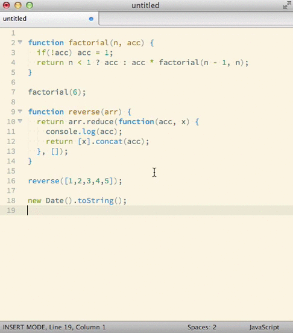

# Sublime Worksheet

This is a Sublime Text plugin for Mac OS X and Linux which passes the contents of a buffer line-by-line to a REPL and displays the results inline.

It works in Sublime Text 2 and 3.



It's great for trying things out directly in Sublime Text.

**Windows support** Thanks to @timonwong v0.8.0 introduces experimental Windows support. Please report any issues you discover.

## In this document

 - [Installation](#installation)
 - [Usage](#usage)
 - [Supported languages](#supported-languages)
 - [Known issues](#known-issues)
 - [Contributing](#contributing)

## Installation

### Package Control

[Package Control](http://wbond.net/sublime_packages/package_control) is "a full-featured package manager that helps discovering, installing, updating and removing packages for SublimeText 2." It's the preferred way to manage your SublimeText 2 Packages directory.

[Follow these instructions](http://wbond.net/sublime_packages/package_control/usage) to install Sublime-worksheet with Package Control.

### Using Git

Go to your SublimeText 2 `Packages` directory and clone the repository using the command below:

`$ git clone https://github.com/jcartledge/sublime-worksheet.git`

### Download Manually

Download the files using the .zip download option.  
Unzip the files.  
Copy the folder to your SublimeText 2 Packages directory.

## Usage

Sublime Worksheet provides two commands which you can access from the command palette (<kbd>CMD-SHIFT-P</kbd> / <kbd>CTRL-SHIFT-P</kbd>):

### `Worksheet: Evaluate worksheet`

Passes the contents of the current document line by line to the interpreter which matches its syntax setting.

Results are inserted as comments directly below the statement, as they would appear if you were entering them in the REPL.

This automatically clears the results of previous evaluations first.

You don't need to save the document before running `Evaluate worksheet`, but if it has been saved then you can write imports/requires/includes relative to the file and they should work.

Any errors or timeouts will cause evaluation to stop and the error to be written to the document. A timeout occurs if the REPL hasn't returned a result for an evaluated line after 10 seconds.

### `Worksheet: Clear worksheet results`

Removes comments inserted by evaluating the worksheet.

## Overide settings

You also can override Sublime Worksheet settings per-project so you can use your virtual environnement. For example, to add your virtualenv, just append this to your `.sublime-project` file:

```json
"settings": {
    "worksheet_languages": {
        "Python": {
            "cmd": "/home/adrien/.pyenvs/web2/bin/python -i",
            "prompt": [">>> ", "\\.\\.+ "],
            "prefix": "# > ",
            "error": ["Traceback ", "  File \"<stdin>\","]
        },
    }
}
```

Please see the `worksheet.sublime-settings` for more configuration examples.

## Supported Languages

Sublime worksheet uses the interpreters you have installed on your system. Generally speaking if you can run an interpreter from the command line it should work in Sublime Text. The following languages are supported:

### JavaScript

Uses the interactive mode of the NodeJS command line interpreter.

 - [Installing Node.js via package manager](https://github.com/joyent/node/wiki/Installing-Node.js-via-package-manager)
 - [Source code and binary downloads](http://nodejs.org/download/) 

### Perl

Uses `re.pl` which is provided by the `Devel::REPL` package.

 - Install via [CPAN](http://www.cpan.org/):

```bash
  # You may need to run these as root  
  cpan -i Devel::REPL  
  # You also need to install a readline implemetation:  
  cpan -i Term::ReadLine::Perl
```

 - Install using your OS package manager e.g. `apt-get install libdevel-repl-perl`

### PHP

Uses the PHP CLI executable in interactive mode (`php -a`).  
See your OS package manager documentation or [the PHP website](http://php.net/downloads.php) for help setting this up.

### Python

Uses the interactive mode of the Python binary (`python -i`).  
See your OS package manager documentation or [the Python website](http://www.python.org/download/) for help setting this up.

### Ruby

Uses `irb`.  
See your OS package manager documentation or [the Ruby website](http://www.ruby-lang.org/en/downloads/) for help setting this up.

### Scala

Uses the [Scala REPL](http://www.scala-lang.org/node/2097).  
See your OS package manager documentation or [the Scala website](http://www.scala-lang.org/downloads) for help setting this up.

### Racket/Scheme

Uses [Guile](http://www.gnu.org/software/guile/).  
See your OS package manager documentation or [the Guile website](http://www.gnu.org/software/guile/download.html#releases) for help setting this up.

## Known issues

### Python IndentationError

There is an issue where code which is interpreted correctly by non-interactive Python causes an indentation error in interactive Python.

This arises when indented lines are separated by one or more unindented blank lines. The simple workaround is to indent the blank lines to the level of the surrounding indentation.

For more information see [this issue](https://github.com/jcartledge/sublime-worksheet/issues/23) or [this StackOverflow thread](http://stackoverflow.com/questions/2727988/python-indentation-in-empty-lines).

## Contributing

Please feel free. More REPLs would be great - take a look at [worksheet.sublime-settings](worksheet.sublime-settings) (and [this pull request](https://github.com/jcartledge/sublime-worksheet/pull/22)) for details of how these are implemented.


